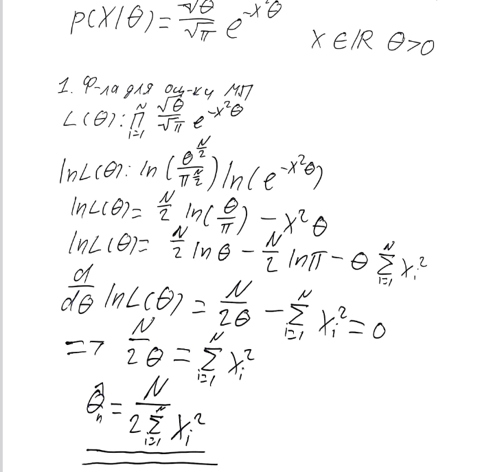
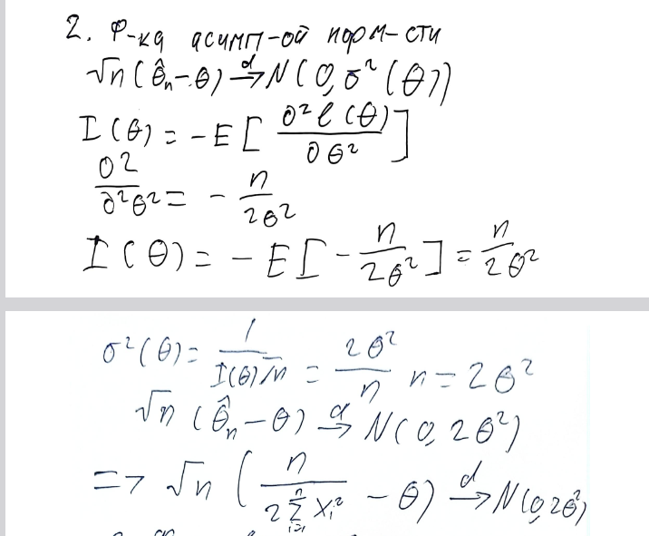
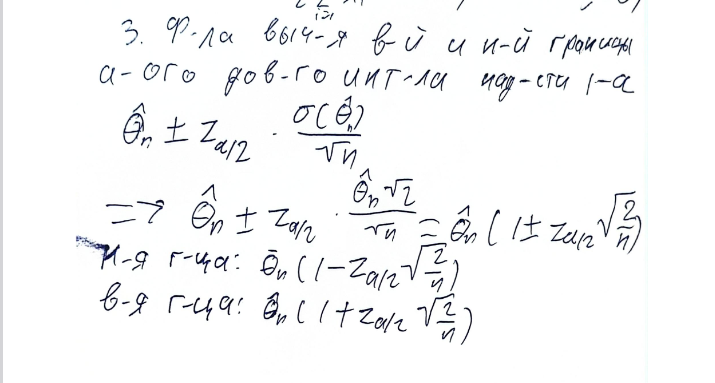
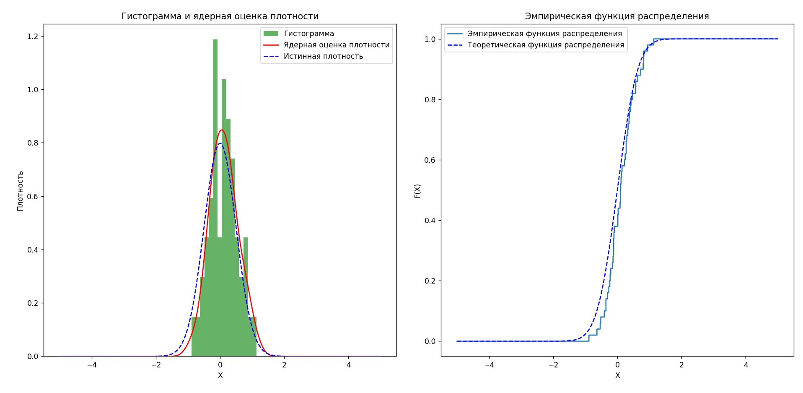

# Задание 2. Дудков Иван

- Функция плотности; Формула для оценки Максимального правдоподобия. Значение оценки θ

- Формулировка асимптотической нормальности

- Формула для вычисления верхней и нижней границ асимптотического доверительного интервала надёжности 1 − α

- Выбранное значение θ; эмпирическую функцию распределения и ядерную
оценку плотности сгенерированной выборки; значения границ полученного доверительного интервала  
Истинное значение theta: 2.0  
Оценка theta (метод максимального правдоподобия): 2.55  
Доверительный интервал для theta (0.95): (1.55, 3.55)  
