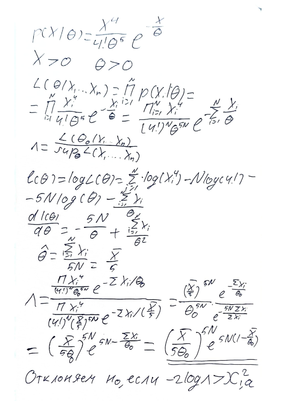
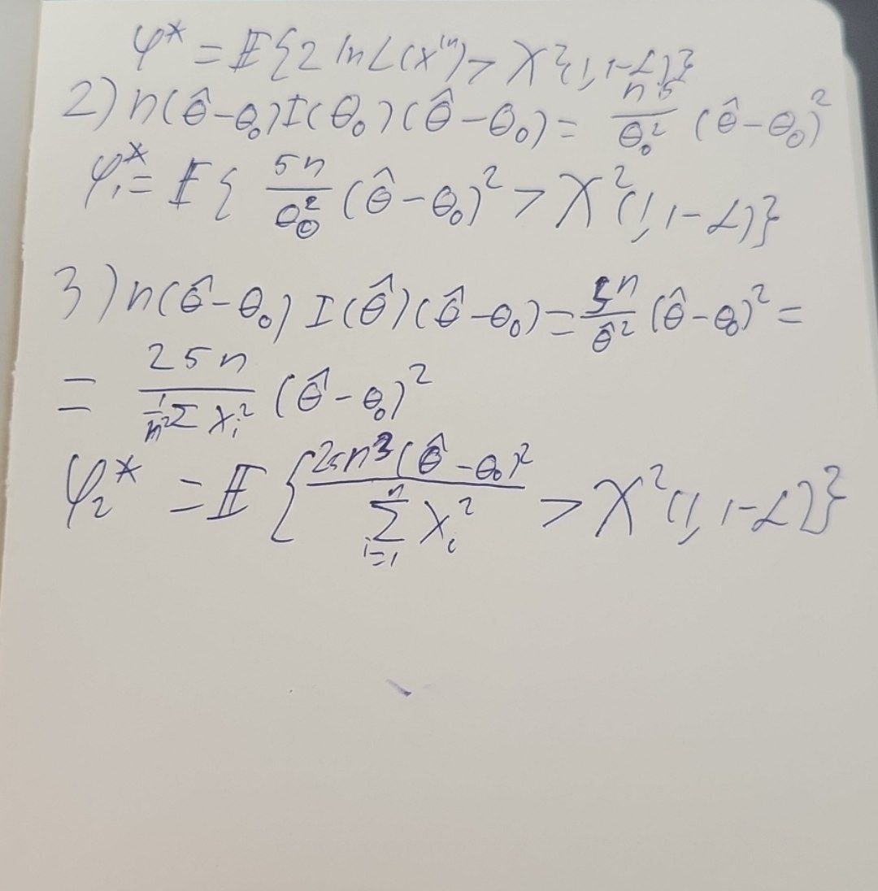
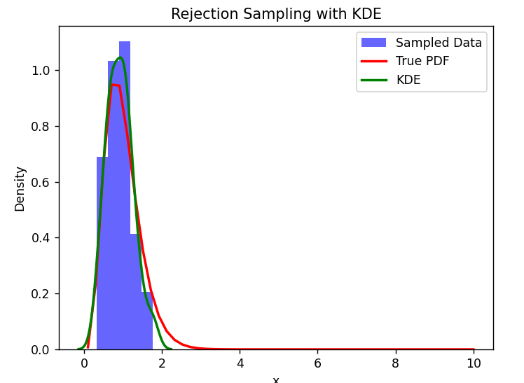

# Задание 3. Дудков Иван

- исходную функцию плотности; формулу для оценки максимального правдоподобия; формулы для вычисления статистик критериев;

- выбранное значение θ0; график ядерной оценки плотности сгенерированной выборки; значения статистик критериев и критических констант, P-значения  

    Значение theta_0: 0.2    
    Значение theta_mle: 0.18630071210035032  
    Критическое значение (χ²(1, 1-α)): 2.705543454095404. Степени свободы: 1  
    p-value: 0.27879785825443937  
    Вычисленная статистика (5n/(θ0^2) * (θm - θ0)^2): 1.173  
    Нет оснований отвергать нулевую гипотезу H0: θ = θ0.  
    #  
    Вычисленная статистика ((25 * n^3) / (np.mean(samples^2))) * (theta_m - theta_0)**2:  
    p-value: 0.24496666082580243  
     -> 1.352  
    Нет оснований отвергать нулевую гипотезу H0: θ = θ0.  
    # 
    p-value: 0.2675211171867484  
    Вычисленная статистика -2*np.log(((np.mean(samples) / (5 * theta_0))^(5*n)) * np.exp(5*n*(1-np.mean(samples)/theta_0)))  
     -> 1.229  
    Нет оснований отвергать нулевую гипотезу H0: θ = θ0.  

